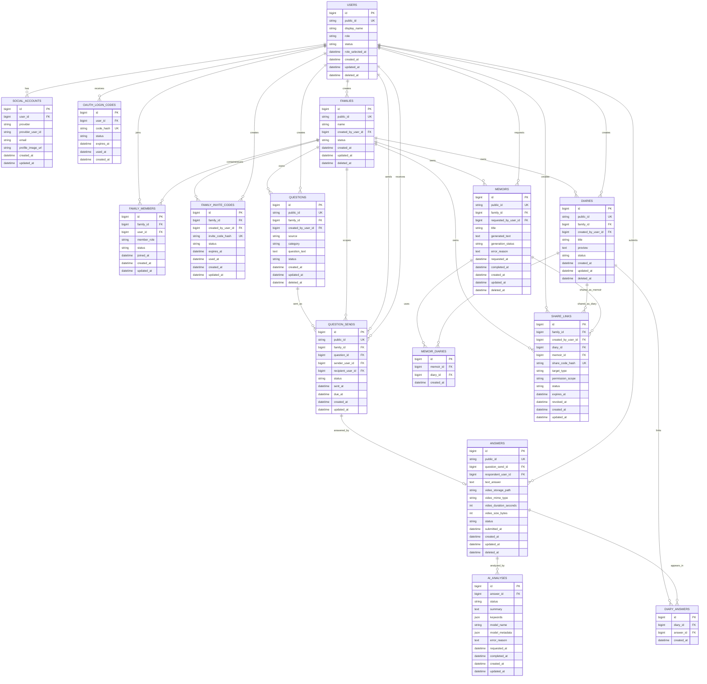

# Damso ERD v0.1

## Scope

이 문서는 Damso MVP 화면 흐름과 현재 API 초안을 기준으로 한 논리 ERD다. 실제 DB 모델, SQLAlchemy 모델, Alembic migration은 아직 만들지 않는다.

포함 범위:

- Kakao 로그인
- 사용자와 소셜 계정
- 가족방, 가족 구성원, 초대 코드
- 질문 목록, 질문 보내기
- 답변과 영상 메타데이터
- AI 분석
- 다이어리
- 회고록
- 공유 링크

제외 범위:

- 결제
- 관리자 기능
- 공개 커뮤니티
- 댓글, 좋아요, 팔로우
- 복잡한 영상 편집
- PDF 내보내기

## Design Principles

- 내부 PK는 `BIGINT`를 사용한다.
- 외부에 노출되는 식별자는 `public_id`, `invite_code`, `share_code` 같은 별도 값을 사용한다.
- 영상 파일은 DB에 저장하지 않고 `storage_path`와 메타데이터만 저장한다.
- Kakao access token은 DB에 저장하지 않는다.
- `social_accounts`는 `provider`, `provider_user_id`를 중심으로 계정을 연결한다.
- Raw invite/share code는 유출 위험을 줄이기 위해 DB에는 해시 저장을 우선한다.

## Mermaid ERD

## Entity Relationships

### Kakao Login

`users`는 Damso 내부 사용자이고, `social_accounts`는 Kakao 같은 외부 OAuth 계정과 연결한다. 카카오 로그인 화면에서 돌아온 뒤 백엔드가 authorization code로 Kakao token/userinfo API를 호출하고, `provider = kakao`, `provider_user_id` 기준으로 사용자를 찾거나 생성한다. Kakao access token은 프론트나 DB에 저장하지 않는다.

`oauth_login_codes`는 백엔드 callback 이후 프론트로 access token을 URL query에 직접 전달하지 않기 위한 일회성 교환 코드다. 프론트는 이 코드를 다시 백엔드에 보내 Damso access token을 받는 흐름을 우선한다.

### Users and Families

역할 선택 화면 때문에 `users.role`, `role_selected_at`이 필요하다. 가족 초대 코드 화면에서는 자녀가 `families`를 만들고 `family_invite_codes`를 발급한다. 부모님은 초대 코드로 합류하며, 그 결과가 `family_members`에 저장된다.

`family_members`는 사용자와 가족의 다대다 관계를 표현한다. 한 사용자가 여러 가족방에 속할 가능성을 MVP 이후에도 막지 않으면서, MVP에서는 현재 가족 조회를 단순하게 구현할 수 있다.

### Questions and Answers

`questions`는 질문 목록 화면의 질문 원문과 출처를 저장한다. `QUESTION_SENDS`는 자녀가 특정 부모님에게 질문을 보낸 행위다. 질문 원문과 질문 발송을 분리하면 같은 질문을 여러 사용자에게 보내거나, 이전 질문 상태를 조회하기 쉽다.

`answers`는 부모님이 스마트폰에서 제출한 텍스트와 영상 메타데이터를 저장한다. 영상 원본은 storage에 저장하고 DB에는 `video_storage_path`만 둔다.

### AI Analysis

`ai_analyses`는 답변별 요약, 키워드, 모델 메타데이터, 실패 사유를 저장한다. 답변 제출 직후 분석 상태를 조회하는 화면 흐름 때문에 `status`, `requested_at`, `completed_at`이 필요하다.

### Diaries and Memoirs

`diaries`는 가족 다이어리 목록/상세 화면의 표시 단위다. 한 다이어리가 여러 답변을 묶을 수 있으므로 `diary_answers` 조인 테이블을 둔다.

`memoirs`는 누적된 다이어리로 생성되는 회고록 결과다. 어떤 다이어리를 재료로 썼는지 추적하기 위해 `memoir_diaries`를 둔다.

### Share Links

공유 링크 화면 흐름은 `share_links`로 처리한다. 공유 대상은 다이어리 또는 회고록이며, `target_type`과 nullable FK(`diary_id`, `memoir_id`)를 함께 두고 둘 중 하나만 채워지도록 체크 제약을 둔다. 공유 URL의 원문 코드는 저장하지 않고 `share_code_hash`로 조회하는 방식을 우선한다.

## Deletion and Status Strategy

주요 사용자 데이터에는 `deleted_at`을 우선 둔다. 사용자, 가족, 질문, 답변, 다이어리, 회고록은 목록/상세에서 숨기더라도 감사와 복구 가능성이 있어 soft delete가 적합하다.

상태 전이가 중요한 테이블에는 `status`를 둔다. 가족 구성원, 초대 코드, 질문 발송, AI 분석, 회고록 생성, 공유 링크는 `active`, `used`, `expired`, `revoked`, `pending`, `completed`, `failed` 같은 상태가 화면과 API 응답에 직접 필요하다.

`deleted_at`과 `status`를 모두 갖는 테이블은 사용자에게 보이는 주요 콘텐츠다. 삭제 여부와 작업 상태가 서로 다른 의미이기 때문이다. 예를 들어 회고록은 `generation_status = completed`이면서 나중에 `deleted_at`으로 숨겨질 수 있다.

## API Draft Notes

- `SCREEN_FLOW.md`에는 공유 링크 API 후보가 있으나 `docs/API_DRAFT.md`에는 아직 `share-links` 섹션이 없다. MVP 공유 링크를 유지한다면 `POST /api/v1/share-links`, `GET /api/v1/share-links/{share_code}` 추가가 자연스럽다.
- 현재 `API_DRAFT.md`는 `{family_id}`, `{question_id}` 같은 이름을 쓰지만, DB 설계상 외부 API에는 내부 `BIGINT id` 대신 `public_id` 사용을 권장한다. 내부 PK 노출을 막고 추측 가능한 순차 ID 접근을 줄일 수 있다.
- `MVP_SCOPE.md`에는 공유 링크가 포함 기능과 제외 기능 양쪽에 적혀 있다. 이번 ERD는 사용자 요청과 `SCREEN_FLOW.md`를 따라 MVP 공유 링크를 포함한다.
