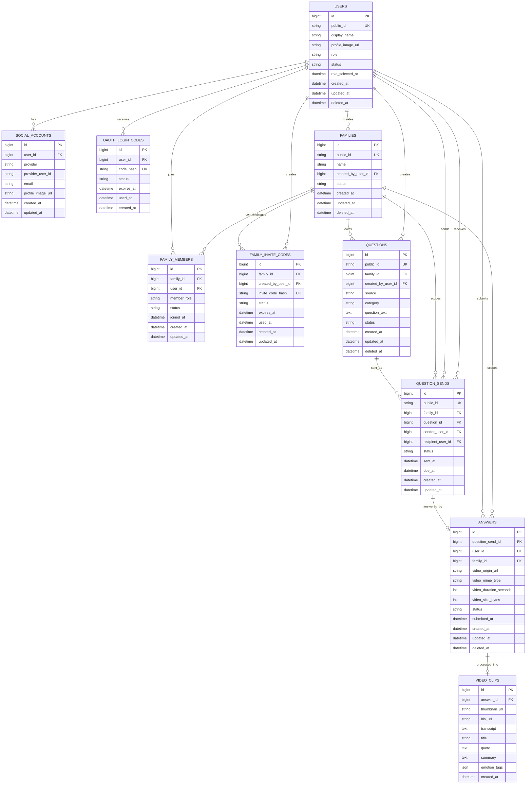

# Damso ERD v0.1

## Scope

이 문서는 Damso MVP 화면 흐름과 현재 API 초안을 기준으로 한 논리 ERD다. 실제 DB 모델, SQLAlchemy 모델, Alembic migration은 아직 만들지 않는다.

포함 범위:

- Kakao 로그인
- 사용자와 소셜 계정
- 가족방, 가족 구성원, 초대 코드
- 질문 목록, 질문 보내기
- 답변과 영상 메타데이터
- 영상 클립(AI 가공 결과)

제외 범위:

- 결제
- 관리자 기능
- 공개 커뮤니티
- 댓글, 좋아요, 팔로우
- 복잡한 영상 편집
- PDF 내보내기

## Design Principles

- 내부 PK는 `BIGINT`를 사용한다.
- 외부에 노출되는 식별자는 `public_id`, `invite_code` 같은 별도 값을 사용한다.
- 영상 원본은 DB에 저장하지 않고 `video_origin_url`과 메타데이터만 저장한다. 가공본(`hls_url`)은 `video_clips`에 분리 저장한다.
- Kakao access token은 DB에 저장하지 않는다.
- `social_accounts`는 `provider`, `provider_user_id`를 중심으로 계정을 연결한다.
- Raw invite code는 유출 위험을 줄이기 위해 DB에는 해시 저장을 우선한다.

## Mermaid ERD

## Entity Relationships

### Kakao Login

`users`는 Damso 내부 사용자이고, `social_accounts`는 Kakao 같은 외부 OAuth 계정과 연결한다. 카카오 로그인 화면에서 돌아온 뒤 백엔드가 authorization code로 Kakao token/userinfo API를 호출하고, `provider = kakao`, `provider_user_id` 기준으로 사용자를 찾거나 생성한다. Kakao access token은 프론트나 DB에 저장하지 않는다.

`oauth_login_codes`는 백엔드 callback 이후 프론트로 access token을 URL query에 직접 전달하지 않기 위한 일회성 교환 코드다. 프론트는 이 코드를 다시 백엔드에 보내 Damso access token을 받는 흐름을 우선한다.

### Users and Families

역할 선택 화면 때문에 `users.role`, `role_selected_at`이 필요하다. 가족 초대 코드 화면에서는 자녀가 `families`를 만들고 `family_invite_codes`를 발급한다. 부모님은 초대 코드로 합류하며, 그 결과가 `family_members`에 저장된다.

`family_members`는 사용자와 가족의 다대다 관계를 표현한다. 한 사용자가 여러 가족방에 속할 가능성을 MVP 이후에도 막지 않으면서, MVP에서는 현재 가족 조회를 단순하게 구현할 수 있다.

### Questions and Answers

`questions`는 질문 목록 화면의 질문 원문과 출처를 저장한다. `QUESTION_SENDS`는 자녀가 특정 부모님에게 질문을 보낸 행위다. 질문 원문과 질문 발송을 분리하면 같은 질문을 여러 사용자에게 보내거나, 이전 질문 상태를 조회하기 쉽다.

`answers`는 부모님이 스마트폰에서 제출한 영상 메타데이터를 저장한다. 영상 원본은 storage에 저장하고 DB에는 `video_origin_url`만 둔다. `family_id`는 `question_sends.family_id`를 비정규화 복사해 네컷 그리드 조회(`family_id`, `DATE(created_at)` 기준 `GROUP BY`)를 별도 테이블 없이 처리한다.

### Video Clips

`video_clips`는 답변 영상을 AI로 가공한 결과(썸네일, HLS 스트리밍 URL, 전사, 제목, 명대사, 요약, 감정 태그)를 저장한다. 네컷 그리드에서 컷을 탭하면 바텀시트 또는 상세 화면에서 이 데이터로 영상 재생, 명대사, 요약을 보여준다.

## Deletion and Status Strategy

주요 사용자 데이터에는 `deleted_at`을 우선 둔다. 사용자, 가족, 질문, 답변은 목록/상세에서 숨기더라도 감사와 복구 가능성이 있어 soft delete가 적합하다.

상태 전이가 중요한 테이블에는 `status`를 둔다. 가족 구성원, 초대 코드, 질문 발송은 `active`, `used`, `expired`, `revoked` 같은 상태가 필요하다. 답변은 제출부터 AI 처리까지의 흐름을 `submitted`, `processing`, `completed`, `failed`로 표현한다.

## API Draft Notes

- 현재 `API_DRAFT.md`는 `{family_id}`, `{question_id}` 같은 이름을 쓰지만, DB 설계상 외부 API에는 내부 `BIGINT id` 대신 `public_id` 사용을 권장한다. 내부 PK 노출을 막고 추측 가능한 순차 ID 접근을 줄일 수 있다. `answers`, `video_clips`는 현재 외부 상세 조회 API가 없어 `public_id`를 두지 않았다.
