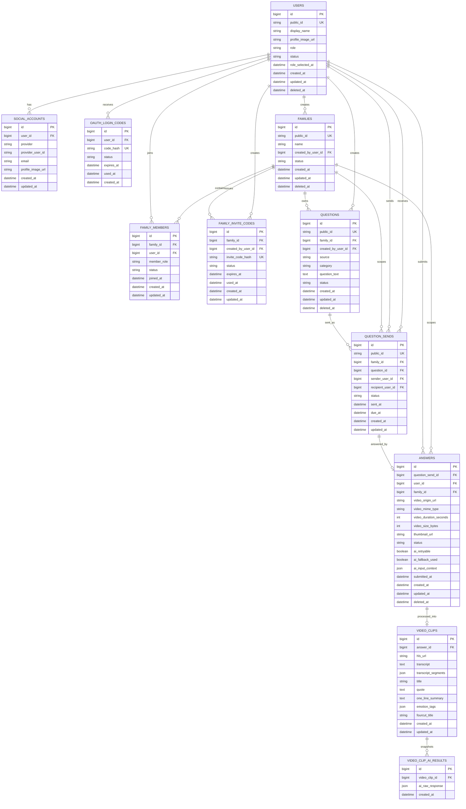

# Damso ERD v0.1

## Scope

이 문서는 Damso MVP 화면 흐름과 현재 API 초안을 기준으로 한 논리 ERD다. 실제 DB 모델, SQLAlchemy 모델, Alembic migration은 아직 만들지 않는다.

포함 범위:

- Kakao 로그인
- 사용자와 소셜 계정
- 가족방, 가족 구성원, 초대 코드
- 질문 목록, 질문 보내기
- 답변과 영상 메타데이터
- 영상 클립(AI 가공 결과)

제외 범위:

- 결제
- 관리자 기능
- 공개 커뮤니티
- 댓글, 좋아요, 팔로우
- 복잡한 영상 편집
- PDF 내보내기

## Design Principles

- 내부 PK는 `BIGINT`를 사용한다.
- 외부에 노출되는 식별자는 `public_id`, `invite_code` 같은 별도 값을 사용한다.
- 영상 원본은 DB에 저장하지 않고 `video_origin_url`과 메타데이터만 저장한다. 가공본(`hls_url`)은 `video_clips`에 분리 저장한다.
- 썸네일(`answers.thumbnail_url`)은 답변 제출 직후 AI 처리와 무관하게 생성되므로 `answers`에 둔다. `video_clips`는 AI 처리가 끝나야 생기는 데이터만 저장하며 썸네일을 중복 저장하지 않는다.
- AI 서버 pipelineResults 원본 전체는 `video_clip_ai_results`에 snapshot으로 보관하고, `video_clips`는 프론트가 바로 쓰는 필드만 정제해서 저장한다.
- Kakao access token은 DB에 저장하지 않는다.
- `social_accounts`는 `provider`, `provider_user_id`를 중심으로 계정을 연결한다.
- Raw invite code는 유출 위험을 줄이기 위해 DB에는 해시 저장을 우선한다.

## Mermaid ERD



## Entity Relationships

### Kakao Login

`users`는 Damso 내부 사용자이고, `social_accounts`는 Kakao 같은 외부 OAuth 계정과 연결한다. 카카오 로그인 화면에서 돌아온 뒤 백엔드가 authorization code로 Kakao token/userinfo API를 호출하고, `provider = kakao`, `provider_user_id` 기준으로 사용자를 찾거나 생성한다. Kakao access token은 프론트나 DB에 저장하지 않는다.

`oauth_login_codes`는 백엔드 callback 이후 프론트로 access token을 URL query에 직접 전달하지 않기 위한 일회성 교환 코드다. 프론트는 이 코드를 다시 백엔드에 보내 Damso access token을 받는 흐름을 우선한다.

### Users and Families

역할 선택 화면 때문에 `users.role`, `role_selected_at`이 필요하다. 온보딩 역할은 자식/엄마/아빠 3가지이며 API enum 값은 `child`, `mother`, `father`다. 가족 초대 코드 화면에서는 자녀가 `families`를 만들고 `family_invite_codes`를 발급한다. 부모님은 초대 코드로 합류하며, 그 결과가 `family_members`에 저장된다.

`family_members`는 사용자와 가족의 다대다 관계를 표현한다. 한 사용자가 여러 가족방에 속할 가능성을 MVP 이후에도 막지 않으면서, MVP에서는 현재 가족 조회를 단순하게 구현할 수 있다.

### Questions and Answers

`questions`는 질문 목록 화면의 질문 원문과 출처를 저장한다. `QUESTION_SENDS`는 자녀가 특정 부모님에게 질문을 보낸 행위다. 질문 원문과 질문 발송을 분리하면 같은 질문을 여러 사용자에게 보내거나, 이전 질문 상태를 조회하기 쉽다.

`answers`는 부모님이 스마트폰에서 제출한 영상 메타데이터를 저장한다. 영상 원본은 storage에 저장하고 DB에는 `video_origin_url`만 둔다. `family_id`는 `question_sends.family_id`를 비정규화 복사해 네컷 그리드 조회(`family_id`, `DATE(created_at)` 기준 `GROUP BY`)를 별도 테이블 없이 처리한다.

### Video Clips

AI 처리 파이프라인은 다음과 같다 (2026-07-06 확정).

```
클라이언트 → GCS Signed URL로 원본 mp4 업로드 → POST /api/v1/answers

답변 백엔드 플로우
  → answers insert (status: submitted)
  → BackgroundTasks
      ├── ffmpeg 썸네일 추출 → GCS 업로드 → answers.thumbnail_url 업데이트
      └── AI 서버 POST (fire and forget, mediaPath JSON 모드)
  → 201 반환

AI 서버
  → STT + LLM 파이프라인 (AI-002~AI-009). 영상 자체는 가공하지 않는다.
  → 백엔드 콜백 POST /api/v1/answers/ai-callback (pipelineResults JSON)

영상처리 백엔드 (콜백 수신)
  → ffmpeg HLS 변환 → GCS 업로드
  → video_clips insert (+ video_clip_ai_results에 원본 pipelineResults snapshot)
  → answers.status = completed 업데이트
  → Supabase Realtime broadcast
```

`POST /api/v1/answers/ai-callback`은 백엔드가 직접 만드는 엔드포인트다. AI 서버가 처리 완료 후 이 URL로 호출하며, Supabase에 AI 서버가 직접 write하는 경로는 없다. AI API 스펙(`DAMSO-AI-API` 명세)의 `api/v1/ai/{기능}` 네이밍은 AI 서버 자신의 엔드포인트 규칙이라, 영상 답변 쪽 콜백 수신 엔드포인트는 그 네임스페이스와 겹치지 않도록 `answers` 리소스 하위(`/api/v1/answers/ai-callback`)에 둔다. 요청/콜백 모두 `answerId` 하나로 식별하며, AI API의 별도 `jobId` 필드는 쓰지 않는다.

AI 서버 요청은 JSON Path Mode(`mediaPath`)를 강제한다. AI 개발자가 백엔드 연동이 처음이라 백엔드가 계약을 주도적으로 정의하며, GCS 경로 문자열만 넘기고 실제 파일 바이트를 백엔드가 내려받아 재업로드하지 않는다. 영상 가공(썸네일, HLS)은 AI 서버가 하지 않고 전량 백엔드가 ffmpeg으로 처리하되, 구현 우선순위는 영상 업로드를 먼저 완성하고 AI 연동은 그다음이다.

썸네일은 AI 처리 완료를 기다리지 않고 답변 제출 직후 생성되므로 `answers.thumbnail_url`에 저장하며, 네컷 그리드는 `status`와 무관하게 이 썸네일을 바로 노출할 수 있다. `video_clips`는 AI 콜백을 받은 뒤에야 생기는 가공 결과(HLS 스트리밍 URL, 전사, 제목, 명대사, 한 줄 요약, 감정 태그, 네컷 묶음 제목)만 저장한다. 네컷 그리드에서 컷을 탭하면 바텀시트 또는 상세 화면에서 이 데이터로 영상 재생, 명대사, 요약을 보여준다.

`video_clip_ai_results`는 AI 서버 pipelineResults 전체 원본 응답을 snapshot으로 보관한다. `video_clips`에 정제해서 옮기지 않은 나머지 필드(재처리, 디버깅, 추후 공유 기능용 데이터 등)를 필요할 때 꺼내 쓰기 위한 용도이며, 한 클립에 대해 재처리가 여러 번 있었다면 여러 row가 쌓일 수 있다.

## Deletion and Status Strategy

주요 사용자 데이터에는 `deleted_at`을 우선 둔다. 사용자, 가족, 질문, 답변은 목록/상세에서 숨기더라도 감사와 복구 가능성이 있어 soft delete가 적합하다.

상태 전이가 중요한 테이블에는 `status`를 둔다. 가족 구성원, 초대 코드, 질문 발송은 `active`, `used`, `expired`, `revoked` 같은 상태가 필요하다. 답변은 제출부터 AI 처리까지의 흐름을 `submitted`, `processing`, `completed`, `failed`로 표현한다.

## API Draft Notes

- 현재 `API_DRAFT.md`는 `{family_id}`, `{question_id}` 같은 이름을 쓰지만, DB 설계상 외부 API에는 내부 `BIGINT id` 대신 `public_id` 사용을 권장한다. 내부 PK 노출을 막고 추측 가능한 순차 ID 접근을 줄일 수 있다. `answers`, `video_clips`는 현재 외부 상세 조회 API가 없어 `public_id`를 두지 않았다. `video_clip_ai_results`도 외부 API 노출이 없어 마찬가지다.
- `POST /api/v1/answers/ai-callback`은 AI 서버가 백엔드를 호출하는 콜백 엔드포인트다. 상세 요청/응답 스펙은 `docs/API_DRAFT.md`의 Answers 절에 문서화한다.
